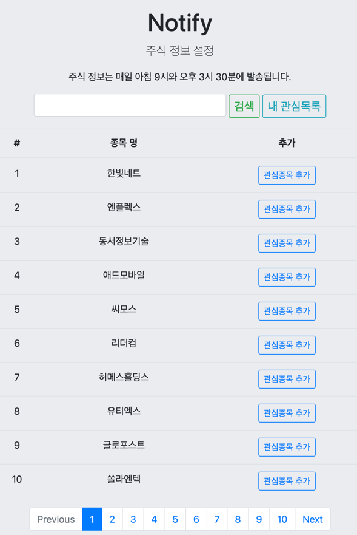
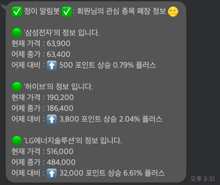
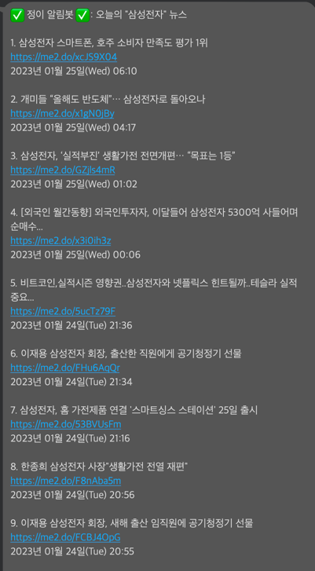
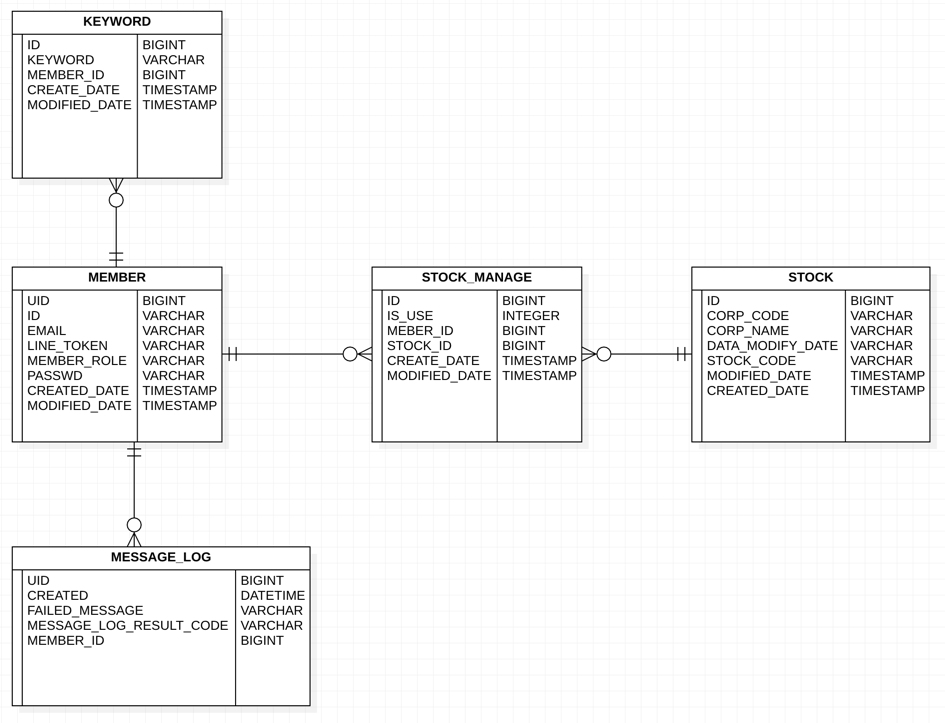

# Notify DashBoard (최신화 2023/01/26)

### 주소
- http://notify.n-e.kr/loginForm

### 서비스 내용
- 사용자가 원하는 키워드가 포함된 뉴스 및 주식 관심 종목의 시가, 종가 알림 서비스.

### 개발 목적
- 공부 했던 것들을 실제로 구현해보기 위해 간단한 토이 프로젝트 개발
- 사용자가 원하는 키워드가 포함된 뉴스 및 주식 관심 종목의 시가, 종가 알림 서비스
- 존버 해놨던 주식들을 매일매일 확인 할 수 없기 때문에, 시가와 종가만 알고 싶어서..

### 기술 스택
- Java 8, 전자공시 다트 API, 네이버 검색 API , Spring Boot 2.7.2, Spring Batch
- MySQL, AWS EC2, Nginx, Docker, Github Actions

### 사용 화면

### ERD

### 아쉬운 점
- 주식 가격의 정보를 단순한 네이버 증권 크롤링으로 가져온 부분이 아쉽다.
  - 찾아보니 한국투자 증권 오픈 API 를 사용하면 괜찮을 거 같아서 적용해 볼 예정이다.
- 전자공시 다트 API 에는 데이터가 오래되어 이미 상장폐지가 됐거나 기업합병이 된 주식들도 상당히 있어서 정확도가 아쉬웠고, ETF 펀드 같은 주식들이 없어서 아쉬웠다.
  - 이 또한 한국투자 증권 오픈 API 를 사용하면 해결이 될 것으로 파악이 된다. (ETF 등 여러 주식들의 정보가 다양하게 나옴)